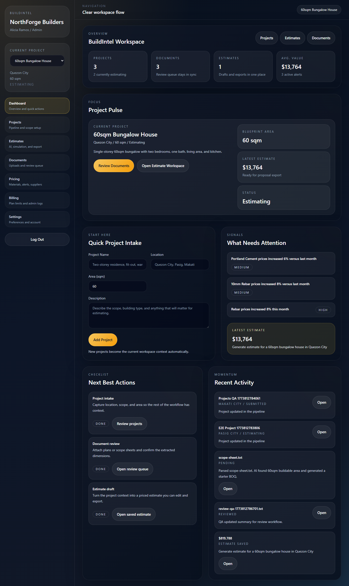
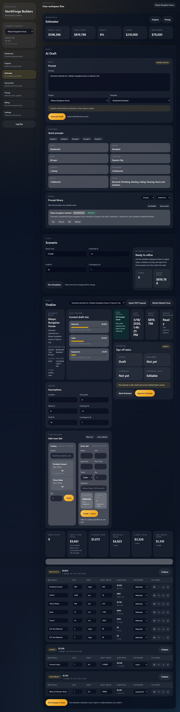
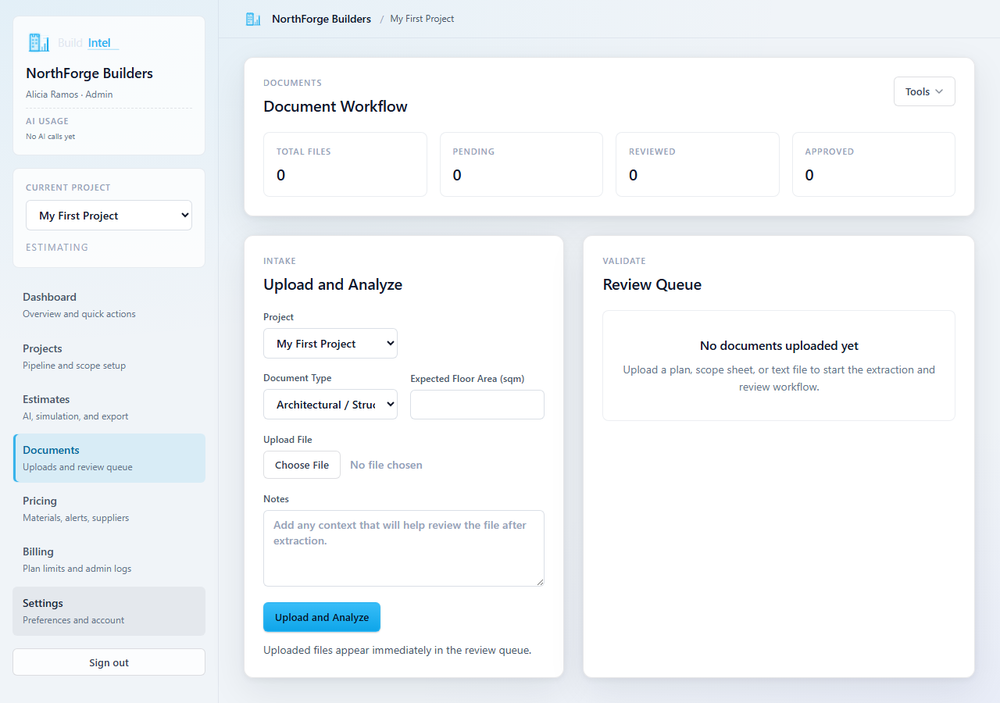
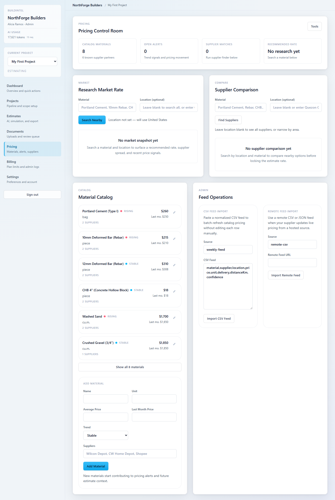

# BuildIntel

AI construction estimating for faster takeoffs, sharper pricing, and more confident bids.


AI construction estimating and costing platform, built on a reusable estimating core for future vertical expansion.

## At A Glance

- turns construction estimating into a structured digital workflow
- combines blueprint analysis, pricing logic, proposal generation, and workspace management
- built to feel like a usable preconstruction product, not just a calculator demo
- positioned for real contractor workflows with room for multi-vertical expansion

## Why This Project Stands Out

BuildIntel is positioned as more than a simple estimator demo. It presents a believable construction workflow where blueprint analysis, pricing logic, estimate generation, supplier comparison, and proposal export live in one product story.

That makes the repo attractive for:

- contractors and operations teams looking for faster preconstruction workflows
- founders or stakeholders evaluating vertical AI product potential
- recruiters and collaborators who want to see real product thinking, not just isolated UI screens

## The Pitch

BuildIntel helps contractors and estimators move from raw plans to clearer pricing decisions with less manual back-and-forth.

Teams get:

- faster estimate preparation
- a more structured takeoff-to-proposal workflow
- clearer visibility into labor, material, equipment, and margin assumptions
- a stronger digital foundation for repeatable bidding operations

## Demo Flow

1. A user uploads project or blueprint-related inputs.
2. The platform extracts relevant context and generates estimate-ready structure.
3. Pricing logic and estimate composition turn that data into a usable costing workflow.
4. Teams review suppliers, margins, and proposal outputs inside the same product story.
5. The estimate can be refined and exported for handoff.

That flow makes BuildIntel feel like a real preconstruction platform rather than a narrow AI feature.

## Screenshots

### Workspace Overview



### Estimate Workflow



### Document Intelligence



### Pricing Research



## Quality Signals

- full app build passes locally
- server integration test suite passes locally
- local npm audit is clean at the repo root
- repo includes GitHub issue templates, PR template, license, security policy, and contribution guide

## Repository Standards

- License: [LICENSE](/d:/Web%20App/BuildIntel/LICENSE)
- Security policy: [SECURITY.md](/d:/Web%20App/BuildIntel/SECURITY.md)
- Contribution guide: [CONTRIBUTING.md](/d:/Web%20App/BuildIntel/CONTRIBUTING.md)

## Positioning

BuildIntel should be presented publicly as a construction-first product.

External message:

- AI construction estimating and costing platform
- built for contractors, estimators, and small construction companies

Internal product strategy:

- universal estimating engine
- construction as the first vertical pack
- future expansion into service, fabrication, maintenance, and specialty trades

## Business Value

- shortens the path from plan review to estimate creation
- reduces scattered spreadsheet-style estimating work
- creates a more professional digital workflow for small construction teams
- supports better pricing consistency and proposal readiness
- provides a strong product base for AI-assisted estimating expansion

## Why It Wins

- grounded in a real construction use case instead of generic AI positioning
- connects estimation logic with workflow and delivery, not just output generation
- useful for both product evaluation and portfolio storytelling
- strong foundation for future vertical packs and more advanced cost intelligence

## Portfolio Value

BuildIntel is a strong portfolio piece because it shows:

- vertical SaaS thinking tied to a credible industry workflow
- practical AI integration inside an end-to-end product
- full-stack delivery across frontend, backend, storage, and export flows
- business framing that goes beyond technical implementation alone

## What is included

- Multi-tenant company workspace with `Admin`, `Estimator`, and `Viewer` roles in the data model
- Authentication flows for registration, login, and demo password reset
- AI-style blueprint analyzer that generates BOQ starter quantities from uploaded plan metadata
- Smart estimate generator for materials, labor, equipment, waste factors, and contract pricing
- Market price research and supplier finder flows with supplier comparison cards
- Profit optimization simulator for overhead, profit, and contingency adjustments
- Material intelligence database and subscription plan dashboard
- PDF proposal export endpoint for estimate handoff
- PostgreSQL-ready schema at [server/db/schema.sql](/d:/Web%20App/BuildIntel/server/db/schema.sql)

## Stack

- Frontend: React + Vite + Tailwind CSS
- Backend: Node.js + Express
- Database target: PostgreSQL schema provided, demo runtime uses seeded JSON storage so the app runs without external services

## Run locally

```bash
npm install
npm run seed
npm run dev
```

Frontend runs at `http://localhost:5173` and the API runs at `http://localhost:4000`.

## PostgreSQL Mode

The app still boots in demo mode by default so the workspace stays runnable without external services.

To run Phase 1 against PostgreSQL instead:

```bash
cp .env.example .env
# set DEMO_MODE=false and DATABASE_URL to your database
npm run migrate
npm run seed
npm run dev
```

## OpenAI Estimate Provider

The app still defaults to the local demo estimate engine. To route estimate generation through OpenAI instead:

```bash
cp .env.example .env
# keep your existing settings, then set:
# AI_PROVIDER=openai
# OPENAI_API_KEY=your_key_here
# OPENAI_MODEL=gpt-4.1-mini
npm run dev
```

When `AI_PROVIDER=openai`, the `/api/ai/estimate` route uses the official OpenAI Node SDK and the Responses API, then validates the returned JSON before saving the estimate.

The same provider setting is also used for document extraction:

- `/api/ai/blueprint`
- `/api/projects/:id/documents`

For text-like uploads such as `.txt`, `.md`, `.csv`, and `.json`, the server forwards extracted text context to OpenAI. If the OpenAI extraction call fails, the app automatically falls back to the local heuristic analyzer so the workflow remains usable.

## GitHub Models Provider

If you want a cloud AI option without using the OpenAI API billing path, the app can also use GitHub Models.

```bash
cp .env.example .env
# keep your existing settings, then set:
# AI_PROVIDER=github-models
# GITHUB_MODELS_TOKEN=your_github_pat_with_models_scope
# GITHUB_MODELS_MODEL=openai/gpt-4.1
npm run dev
```

When `AI_PROVIDER=github-models`, the app sends estimate-generation and document-extraction requests to GitHub Models using the chat completions inference endpoint.

## Deployment Path

The production server can now serve the built React app directly from the Express process after `npm run build`.

For a basic staging stack with PostgreSQL:

```bash
docker compose up --build
```

That stack:

- builds the client and server into one container
- runs PostgreSQL alongside the app
- applies migrations before the server boots
- serves the UI and API from `http://localhost:4000`

## CI

This repo now includes a GitHub Actions workflow at `.github/workflows/ci.yml` that runs:

- `npm ci`
- `npm run seed`
- `npm run build`
- `npm run test`
- `npm run test:e2e`

## End-to-End Smoke Test

Playwright is configured at `playwright.config.js` to boot the app in a production-style mode and validate the main UI flow.

Run it locally with:

```bash
npx playwright install chromium
npm run test:e2e
```

## Demo login

- Email: `admin@northforge.dev`
- Password: `buildintel123`

## Notes

- The current price research layer ships with seeded supplier data to keep the app runnable in this workspace.
- `DEMO_MODE` is enabled by default. Add a real persistence layer behind the existing service endpoints when connecting PostgreSQL.
